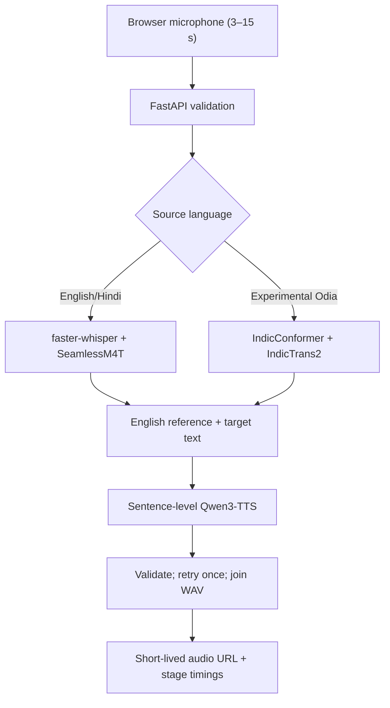

# Voice Translator Lab

An experimental, microphone-first speech translation system exploring whether
open models can translate short speech while retaining some characteristics of
the original speaker.

This is a research prototype, not a production service The repository is
published because the architecture, recovery logic, tests, measurements, and
failure analysis are useful even though the final quality target was not met.

## what was actually demonstrated

| Route | Prototype status | Real listening result |
|---|---|---|
| English → Japanese | Ran end-to-end | Usable on short, clearly spoken clips; translation and voice similarity were inconsistent |
| English → French | Ran end-to-end | Usable on short clips; some longer output omitted words |
| Hindi → Japanese/French | Implemented behind the same API | Automated orchestration tested; real acceptance did not pass |
| Odia → Japanese/French | Experimental route | Dependency-isolated design implemented; real acceptance did not pass |

Automated tests use injected model doubles and prove orchestration—not model
quality. No accuracy, user-count, or production-availability claim is made.
See [EXPERIMENT_RESULTS.md](EXPERIMENT_RESULTS.md) for measurements and failure
modes.

## System design



Engineering work in the repository includes:

- bounded audio upload, MIME/decoding, duration, and voiced-content validation;
- lazy model loading and a single-worker generation lock;
- sentence-level synthesis validation, deterministic retry, and WAV joining;
- structured per-stage errors instead of silent partial output;
- bounded in-memory audio delivery rather than base64-filled JSON;
- stage, cold-start, inference, memory, and duration instrumentation;
- a React/Vite microphone UI with waveform, timeout, autoplay, and fallback
  playback states;
- mocked unit/API tests plus opt-in real-model acceptance scripts;
- an MCP tool adapter and deployment manifests documenting scale constraints.

## Repository map

```text
voice_translator/   FastAPI service and model orchestration
frontend/           React microphone interface
tests/              Unit, API, failure-path, and opt-in real-model tests
scripts/            Acceptance and metrics utilities
notebooks/          Colab GPU experiments
mcp_server/         MCP adapter
k8s/                Scale-out design documentation
```

## Lightweight verification

The lightweight suite does not download model weights:

```bash
python3.12 -m venv .venv
.venv/bin/pip install -r requirements-lightweight.txt
.venv/bin/pytest -ra

cd frontend
npm ci
npm test
npm run typecheck
npm run build
```

Latest lightweight verification for this published snapshot:

- backend: 34 passed, 7 skipped (all skips require real recordings/models);
- frontend: 11 passed;
- TypeScript typecheck and Vite production build: passed;
- npm audit: 0 vulnerabilities.

Real-model inference requires a CUDA environment, several gigabytes of model
weights, FFmpeg/SoX, and model-specific license review. The Colab notebook is
retained as an experiment log; it is not advertised as a one-click production
deployment.

## API contract

`POST /api/translate` accepts multipart fields:

- `audio`
- `source_language=en|hi|ory`
- `target_language=ja|fr`

The response contains the recognized transcript, English reference text,
translated text, model and conditioning metadata, stage timings, and a
short-lived `audio_url`.

## why was the experiment stopped

The self-hosted stuff proved much slower and less reliable than a managed
real-time speech translation model. Cold model loading dominated latency,
speech recognition errors propagated through every later stage, zero-shot
speaker similarity varied, and the mixed ML dependency stack was fragile.

The correct product decision would now be to use a managed streaming model such
as Gemini Live Translate for the primary path and retain this repository only
as a self-hosted baseline. That conclusion is part of the experiment—not hidden
from it.


## Resume-safe description

> Built and evaluated a self-hosted multilingual speech translation prototype
> using FastAPI, React, faster-whisper, SeamlessM4T, IndicTrans2, and zero-shot
> TTS conditioning; added bounded audio handling, sentence-level recovery,
> structured observability, and reproducible mocked versus real-model
> evaluation, then documented latency, quality, and deployment limitations.
